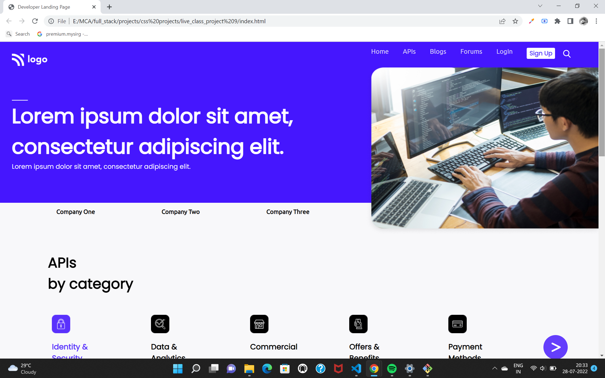
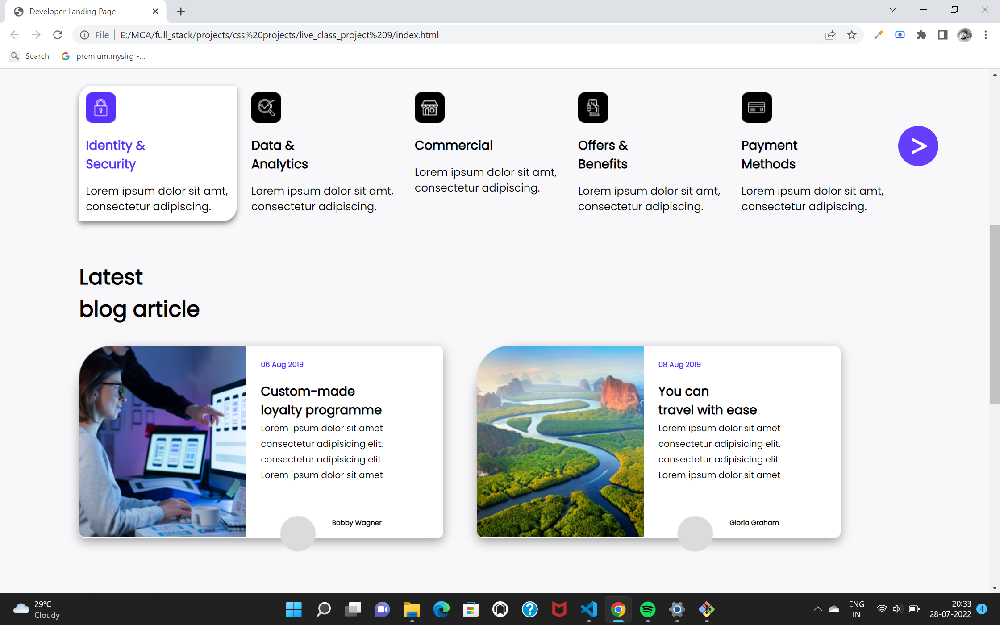
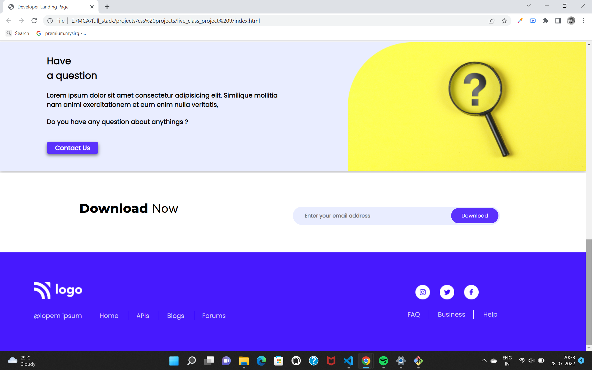

# welcome to Rohan Kaushik's project

OMG this is my biggest achievement till now in my Web development journey here i applied my all knowledge.....

## What I have learnt in this Project
   - I got  comfortable with float problems that comes like when we float the child elements left or right then it is necessory to mention the height of parent element else the height of parent element will become zero and remaining down elements will overwrite your content
   - here I used my positions knowledge and faced many issues also and resolved them
   - here i learned to make cards using flexbox
   - explored the transition property and how can we give 3d look to image or card.
   - I get to know that whenever we required line in between two elements then we can use one way to give equal margin and padding to both elements and have right or left border like you can see in footer section i have given verticalline in between list elements 

## Time Spent on this project

- Excited to tell that This project tooks my 10 hrs and taught me alot really belive me only your efforts can teach you html css else nothing will happen by seeing others doing ...

